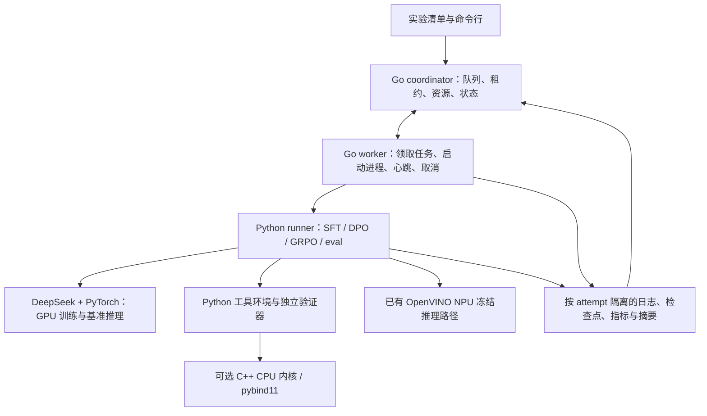

# V4.5.7：V5 的 C++ 加速与 Go 分布式实验系统初步规划

日期：2026-09-26。状态：设计草案；本版完成规划，不包含已实现的原生后端、调度服务或加速成绩。

## 目标与当前依据

V5 采用 Python、C++、Go 三层分工，以更低成本完成可复现的 RL + LLM 实验。Python 保留 DeepSeek、PyTorch、LoRA、SFT/DPO/GRPO 和研究逻辑；C++ 优化经过测量的 CPU 数据处理热点；Go 负责独立实验的排队、资源分配、运行恢复和结果登记。C 只在需要稳定 ABI 或接入已有 C 库时引入，首期不再维护一套与 C++ 重复的内核。

V4.5.6 的静态与动态进度奖励三种子合计均为 221/288，较新 SFT 的 218/288 仅净增 3；一个种子全程没有有效更新。课程扩展还使原最强种子从 82 降至 70/96。这些是训练信号与泛化问题，换语言不能直接解决。V5 的系统改造应帮助我们进行更多受控实验，并与真实数据盲测、课程保留和训练难度研究并行推进。

仓库检查得到以下候选，尚未完成分阶段性能剖析，不能称作已确认瓶颈：

| 当前位置 | 观察到的行为 | V5 首期处理 |
| --- | --- | --- |
| `research/io.py` | CSV 读取为 Python 字典列表，写回并计算文件摘要 | 先计时、检查重复解析与序列化，再决定是否增加列式内部表示 |
| `agent/tools.py` | 工具按行处理，包含整表复制、聚合、移动平均等 | 首个候选为数值列移动平均；随后考虑缺失统计和聚合 |
| `research/v4_sequence_env.py` | observation 重读表，step 调用工具和验证器，result 重建参考终态 | 分别计时；状态缓存必须在成功写入后更新并核对数据版本 |
| `experiments/v4_llm_grpo.py` | 模型生成、环境执行、行为/参考概率计算和反传串行交织 | 保留研究实现；记录各阶段耗时及显存，再判断优化重点 |
| `experiments/v4_llm_eval.py` | 独立任务依次评测 | 多设备可按完整任务分片；单块 GPU 默认串行占用 |
| `research/v4_llm_composition_audit.py` | 对训练预算和逐题结果做离线审计 | 作为 Go 收集结果后的审计步骤，保留独立证据链 |

## 分层架构

Go 调度的是独立种子、配置和评测分片。首期一个训练进程独占一个 GPU，NPU 推理和 CPU 任务分别声明资源；还要限制主机内存及 CPU 线程，避免表面上设备不同却争抢同一主机资源。多 worker 进程在一台电脑上只能验证调度行为，不能作为真实多机扩展证据。

同一次 GRPO 更新的 rollout、参考策略和优化器状态继续由一个 Python 训练进程管理。首期不把异步 worker 的不同版本轨迹混入同一相对优势组。以后若分布式采样，必须记录 policy/adapter 版本、同一任务与故障条件分组、完整组收集和最大策略滞后；DDP/FSDP 等跨 GPU 联合训练另立后续方案。

## C++ 路线与验收

建议 C++17 + CMake + pybind11，作为可选 Python 扩展；先支持 Windows x64，随后验证 Linux。通过 Python 适配层选择 `python` 或 `native`，默认继续使用已验证路径。实验运行中不静默切换后端；扩展不可用时在开跑前明确报错，或按清单中明确允许的回退策略记录实际后端。

首个候选接口为连续 float64 数值数组和窗口参数的移动平均，输出数组由绑定层负责生命周期。一次跨语言调用处理整列，不逐行传 Python 字典。CSV 边界、动作参数绑定、错误类型和结果格式暂由 Python 保持。输入不允许原地修改；空值、非法数值、窗口边界和浮点求和顺序均需与参考实现对照。Python 对象转换完成后才能在纯 C++ 运算区释放 GIL，返回 Python 对象前恢复；pybind11 不会自动释放 GIL。[pybind11 官方说明](https://pybind11.readthedocs.io/en/stable/advanced/misc.html)

保持 `research/oracle.py` 与 `verifier/score.py` 独立，首期不把验证器和工具同时迁到同一个原生实现，以免相同错误同时进入执行与评分。不得调整当前浮点容差来迁就新后端；数值工具除答案比较外，还要核对写回表、行序、空值和格式。日期、Unicode 大写/空格处理等语义复杂工具后移，避免首期引入平台差异。

先测原版，再测 Python/NumPy 优化和 C++ 候选。数据规模覆盖现有小表以及独立构造的 1千、10万、100万行压力表；压力表只用于性能，不能计为泛化测试。每组固定输入摘要、线程数和硬件，预热后至少 10 次重复，报告中位数、p95、峰值内存、转换/复制时间、内核时间和完整 episode 时间。GPU 阶段用恰当的同步或设备事件计时，避免只测到异步提交。

拟定采用门槛：正确性差分全通过；目标热点至少 2 倍加速；目标负载完整 episode 或导出流程至少降低 10% 耗时；小表场景中位数退化不超过 5%。这些是待验收目标，不是已取得成绩。若只占总耗时 10% 的部分加速 2 倍，总体理论加速仅约 1.053 倍，因此不能拿局部内核成绩宣称整个训练提速。若性能主要消耗于模型生成，应优先研究批处理和模型驻留，而非扩大 C++ 重写范围。

## Go 实验管理路线

先实现单协调器、多个 worker 的任务管理。单机阶段可用协调器独占的本地 SQLite 存任务状态，worker 不直接访问数据库；多机阶段按并发需求迁移 PostgreSQL。首个单机接口用版本化 HTTP/JSON，先固定语义；需要强类型流式日志时再引入 gRPC/Protobuf，避免同时维护两套首期协议。gRPC 的 deadline、状态及取消机制可用于未来通信层，但不代替持久化任务状态或幂等设计。[gRPC 官方概念](https://grpc.io/docs/what-is-grpc/core-concepts/)

Worker 通过明确的 Python 可执行文件和参数数组启动预先登记的模块，捕获 stdout/stderr 和退出码，不拼接任意 shell 命令。Go `os/exec` 默认不经 shell，适合此进程边界；取消必须另外验证进程树清理，Windows 规划使用 Job Object，Linux 使用进程组，不能只杀父进程便释放 GPU 资源。[Go os/exec 文档](https://pkg.go.dev/os/exec)

最低功能与语义：

- **提交与复现**：固定配置、代码提交、模型/适配器/数据/协议摘要；同一清单可显式创建重复实验，但网络重试提交通过幂等键去重。
- **资源与排队**：CPU 核数、RAM、设备类型与设备 ID、显存需求；单 GPU 默认一个训练任务，先测量再开放并行。
- **租约与恢复**：协调器原子发放递增 attempt 与 fencing token；worker 定期心跳。租约过期后的旧 worker 不能登记最终结果，新尝试使用独立目录。
- **失败与重试**：基础设施失联可按上限重试；任务验证失败和模型得分低属于实验结果，不能自动重试到成功。OOM 记录原配置；改变 batch 或精度必须建立新实验。
- **取消**：先请求退出并等待宽限期，再终止进程树；确认进程退出后释放资源。无法确认的失联设备暂不重新分配给同机任务。
- **结果登记**：上传或复制到 attempt 临时目录，核对摘要和必需指标后，凭有效 fencing token 原子登记成功；重复完成请求幂等返回同一结果。只保证一次有效结果登记，不承诺执行恰好一次。
- **检查点**：只从完整写入并有摘要的检查点恢复。当前 GRPO 没有完整训练续跑协议，首期失联按新 attempt 从初始化重跑；真正断点续训需另存优化器、随机数、调度器、组位置和策略版本并验证一致性。

状态建议为 `QUEUED → LEASED → RUNNING → SUCCEEDED/FAILED/CANCELLED`，运行失联可标记 `LOST` 并按策略生成新 attempt。网络抖动和租约过期必须有审计事件；旧尝试的迟到结果保留日志但不能覆盖正式指标。协调器重启后从持久状态恢复，重新判断租约；worker 重启要先检查残留子进程与设备占用。

## 语言边界的数据契约草案

本版仅固定字段方向；实现前再写 JSON Schema 与兼容性测试。

| 对象 | 最低字段 | 约束 |
| --- | --- | --- |
| ExperimentSpec v1 | experiment_id、submission_key、entrypoint、seed、hyperparameters、budget、resource_request | entrypoint 为登记名称；预算含训练轨迹/API 请求/时间上限，不仅有 epoch |
| Provenance | git_commit、dirty_patch_sha256、environment_lock_sha256、model_sha256、adapter_sha256、protocol_sha256、dataset_sha256、tool_backend | 跨平台只保证可追溯与语义一致，不保证浮点训练逐位相同 |
| Lease v1 | run_id、attempt_id、worker_id、fencing_token、expires_at | 服务端原子更新；所有状态和完成请求携带租约身份 |
| Event v1 | run_id、attempt_id、sequence、timestamp、phase、event_type、payload | sequence 在 attempt 内单调；重复事件去重，日志分块并支持断点读取 |
| ResultManifest v1 | status、metrics_schema、metrics、artifact_uris、artifact_hashes、exit_code、failure_class | 成功必须同时满足进程成功退出和产物验证，不能只看退出码 |

跨机器传逻辑 artifact URI 和内容摘要，不直接传本机 `C:\...` 路径；worker 在本地缓存解析。日志只携带密钥名称或凭据引用，DeepSeek API 密钥由 worker 的本地配置注入。API 请求总预算由协调器分配额度，失联后未核销额度保守占用，避免多 worker 各自认为仍有完整额度。多机连接再接入认证和加密，首期服务默认仅监听本机。

训练 worker 只获得训练标签，评测由独立作业读取对应标签；真正盲测的标签不能随公共任务清单下发给训练进程。分片评测按 `(task_id, fault, policy_hash)` 合并，必须检查无重复、无缺失、协议一致；不同设备或量化精度分别标注，不把 GPU BF16 与 NPU 结果合并成同一模型分数。

## 分阶段交付与停止条件

| 阶段 | 交付物 | 验收与停止条件 |
| --- | --- | --- |
| V4.5.7（本版） | 本规划、职责边界、候选热点、契约与门槛，README/版本更新 | 明确仅规划；不声称已加速或已分布式 |
| V5.0-alpha.1 | 分阶段计时、固定性能输入、Go 清单与单机 runner 原型 | 同一 Python 作业手工运行与 Go 启动结果/配置一致；能列出阶段占比 |
| V5.0-alpha.2 | 一个 C++ 内核、Python 适配层、构建说明 | 差分测试与端到端门槛通过才启用；收益不足保留 Python 默认 |
| V5.0-alpha.3 | 持久队列、租约、资源独占、取消、日志与结果登记 | 单机两个 worker 的失联、迟到完成、重启、重复提交、进程树取消测试通过 |
| V5.0-beta | 至少两台真实主机、产物存储、评测分片、预算管理 | 同一固定实验矩阵无重复/遗漏有效结果；报告吞吐、总资源时和通信开销；未有第二台主机不得宣称完成多机验收 |
| V5.0 | 版本化部署与恢复文档、固定三种子 RL 矩阵、来源隔离盲测 | 系统可靠性与研究结论分别验收；系统更快不等于 RL 更强 |

建议目录在实施时建立：`native/` 放 C++ 与 CMake，`orchestrator/` 放 Go coordinator/worker，`contracts/` 放版本化消息定义，`benchmarks/` 放性能输入和计时配置。Python 现有模块继续保留，避免一次性迁移全部工具或更换训练框架。

下一步先实施 alpha.1：对一次固定 SFT、一次 GRPO、一次完整评测和专家导出分别测量生成、前向/反向、CSV/工具、验证、写盘时间；同时实现 Go 单机启动一个现有 Python 评测作业的最小闭环。性能与正确性证据出来后，再决定首个 C++ 内核及多机扩展顺序。此阶段不启动新一轮大规模训练，也不更改已冻结的 V4.5.6 结果。
